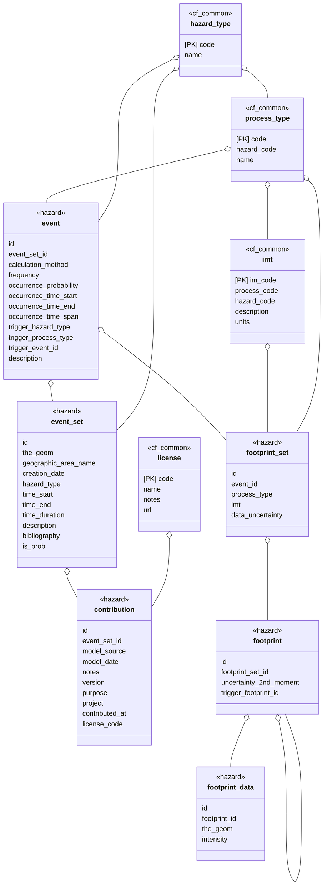

## Common

Utility tables with common entities used as dependencies in all the schemas.

| table name   | short description          |
|--------------|----------------------------|
| hazard_type  | Valid Hazard types         |
| imt          |                            |
| license      | List of supported licenses |
| process type |                            |

## Hazard

A hazard is any agent that can cause harm or damage to humans, property, or the environment. Risk is defined as the probability that exposure to a hazard will lead to a negative consequence, or more simply, a hazard poses no risk if there is no exposure to that hazard.

## Tables

| table name     | short description                                                 |
|----------------|-------------------------------------------------------------------|
| contribution   | Meta-data for contributed model, license, source etc.             |
| event          | A single event, member of an event set                            |
| event_set      | Collection of one or more events                                  |
| footprint      | A single footprint or intensity field, a realization of an event  |
| footprint_data | A single point in a footprint: point location and intensity value |
| footprint_set  | A homogeneous set of footprints associated with an event          |

## Loss

Lorem ipsum dolor sit amet, consectetur adipiscing elit, sed do eiusmod tempor incididunt ut labore et dolore magna aliqua. Ut enim ad minim veniam, quis nostrud exercitation ullamco laboris nisi ut aliquip ex ea commodo consequat. Duis aute irure dolor in reprehenderit in voluptate velit esse cillum dolore eu fugiat nulla pariatur. Excepteur sint occaecat cupidatat non proident, sunt in culpa qui officia deserunt mollit anim id est laborum.

## Exposure

Lorem ipsum dolor sit amet, consectetur adipiscing elit, sed do eiusmod tempor incididunt ut labore et dolore magna aliqua. Ut enim ad minim veniam, quis nostrud exercitation ullamco laboris nisi ut aliquip ex ea commodo consequat. Duis aute irure dolor in reprehenderit in voluptate velit esse cillum dolore eu fugiat nulla pariatur. Excepteur sint occaecat cupidatat non proident, sunt in culpa qui officia deserunt mollit anim id est laborum.

## Vulnerability

Lorem ipsum dolor sit amet, consectetur adipiscing elit, sed do eiusmod tempor incididunt ut labore et dolore magna aliqua. Ut enim ad minim veniam, quis nostrud exercitation ullamco laboris nisi ut aliquip ex ea commodo consequat. Duis aute irure dolor in reprehenderit in voluptate velit esse cillum dolore eu fugiat nulla pariatur. Excepteur sint occaecat cupidatat non proident, sunt in culpa qui officia deserunt mollit anim id est laborum.
